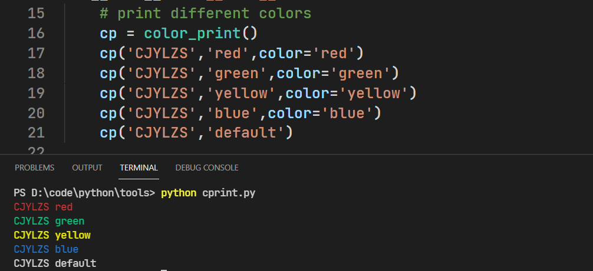
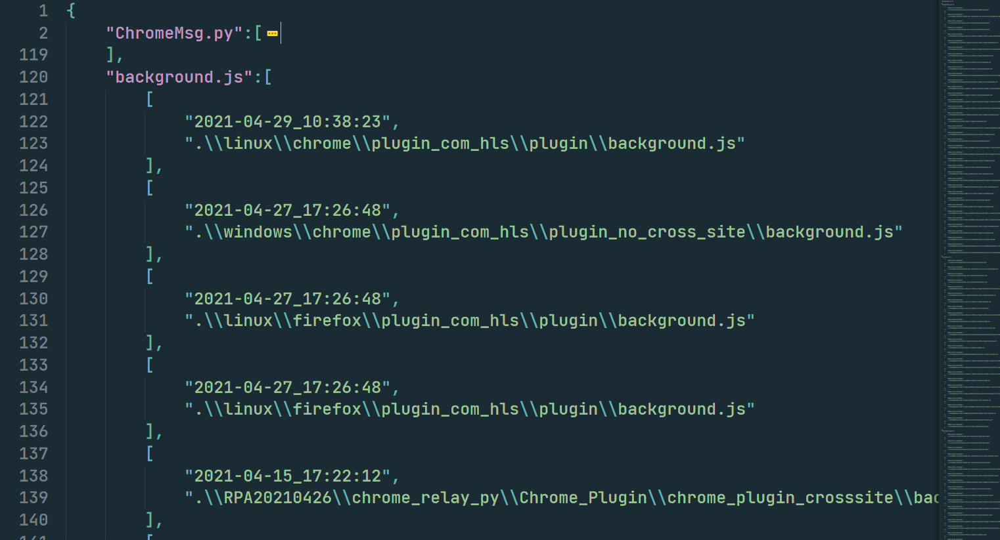

## color print

import and print different color text

## file manager

if there are different version code with same name in different directory

it is hard to distinguish so this tool is used to sort these file

usage:

put FileManager.py in the root directory and execute

python FileManager.py

then a file named resultBeautify.json will generate in the same directory

PS: only more than one file with the same name in different directory will be listed in resultBeautify.json

## raw http to python request

see comment

## scanner

see comment

